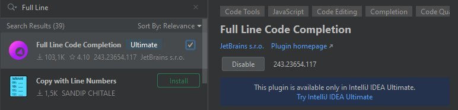

# How to remove the IntelliJ IDEA "AI Assistant"

Since IntelliJ IDEA 2024.1 there is a new ["AI Assistant"](https://www.jetbrains.com/help/idea/ai-assistant.html).

However there are a few problems:
* it's constantly shoved into your face when you open a new project
  * even when you click "Hide"

For more details have a look at [LLM-2639](https://youtrack.jetbrains.com/issue/LLM-2639) and it's related issues.

## IDEA 2024.3.2+

In this version the plugin was moved/renamed to ``fullLine``.

You can disabled the plugin like so:
* Open the ``Settings > Plugins``
* Select the ``Marketplace`` tab as it's somehow not listed in the ``Installed`` tab
* Search for the ``Full Line Code Completion`` plugin: 
* Disable the plugin
* Restart your IDE

A more detailed walkthrough is available as a video:

[Showcase](https://github.com/user-attachments/assets/cfd8950b-5842-4eaf-aff2-fc81a4d1fde9)

## IDEA 2024+ (outdated)

> you have to remove other folder to get rid of this plugin
> it's located in the IDE plugins installation folder called ``llmInstaller`` (up to 2024 it was ``ml-llm``)
[comment from issue](https://youtrack.jetbrains.com/issue/LLM-2639/Promotional-tool-window-opens-every-time-I-open-a-new-project#focus=Comments-27-9719441.0-0)

To remove it on Windows do the following:
* Open ``C:\Program Files\JetBrains\IntelliJ IDEA ...\plugins``
* Remove ``llmInstaller``

> [!WARNING]
> When updating to 2024.3.2 this will break the update process! 
> You have to manually uninstall IDEA and then install the new version.
